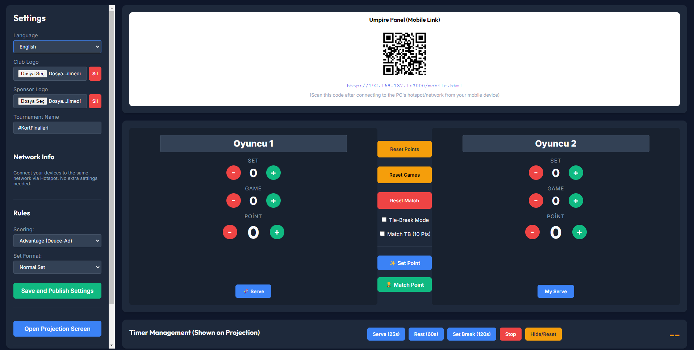
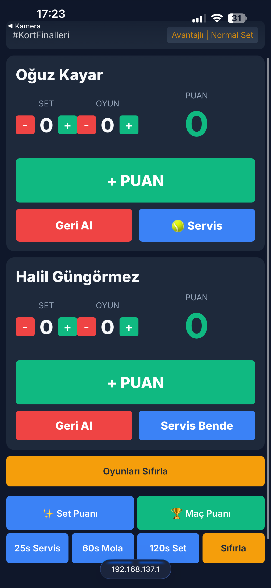
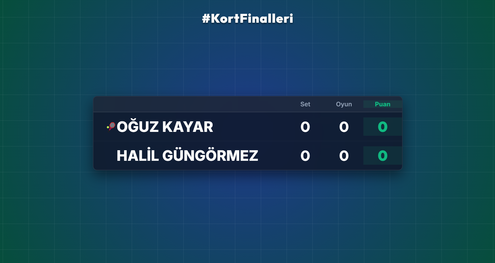

# Skor Tabela (Tennis Scoreboard)

🇬🇧 **English** | [🇹🇷 Türkçe için aşağıya kaydırın (Scroll down for Turkish)](#türkçe)

An entirely offline desktop tennis scoreboard application with TV-broadcast quality animations, which can be controlled via a mobile device over the local network.

### 📸 Screenshots (Ekran Görüntüleri)

| Desktop Control Panel | Mobile Umpire Panel | Projection Screen |
|:---:|:---:|:---:|
|  |  |  |

## 🇬🇧 English

### Features
* **Completely Offline:** Works on the computer's local network without needing an internet connection.
* **Mobile Umpire Panel:** Easily manage the score, sets, and timers using your smartphone or tablet.
* **Dual Screen / Projection Support:** Separate panels for the control board (umpire) and the projection screen (audience).
* **Smart Score Management:** Automatic game calculation according to tennis rules (Advantage or No-Ad Sudden Death) and Tie-Break support.
* **Visual Animations:** Professional, TV-broadcast style animations for critical moments like Set Point and Match Point.
* **Customization:** Add club logos, sponsor logos, and tournament names (Logos are automatically compressed for fast transfer).

### Technologies
* **Electron.js:** Desktop app and window management.
* **Node.js & Express:** Local web server.
* **Socket.io:** Real-time data synchronization across desktop, projection, and mobile screens.
* **HTML/CSS/JS:** Fully custom, sleek, and animated UI design.

### Installation & Usage (Ready-to-Use)
You don't need any coding knowledge or installation to use this project.

1. Click on the `dist-app` folder from the file list above.
2. Click on the **`Skor Tabela 1.0.0.exe`** file, and on the page that opens, click the **"Download raw file"** button on the right side to download it to your computer.
3. Double-click the `.exe` file you downloaded to launch the application instantly. (No internet required).

*(Note: Developers can also clone the project and run it from the source code via `npm install` and `npm start`).*

---

<h2 id="türkçe">🇹🇷 Türkçe</h2>

Tamamen çevrimdışı (offline) çalışabilen, yerel ağ üzerinden mobil cihazlarla kontrol edilebilen, TV yayını kalitesinde animasyonlara sahip masaüstü tenis skorbord uygulaması.

### Özellikler
* **Tamamen Çevrimdışı (Offline):** İnternet bağlantısına ihtiyaç duymadan bilgisayarın kendi ağı üzerinden çalışır.
* **Mobil Kontrol Paneli:** Telefonunuzu veya tabletinizi kullanarak skoru, setleri ve süreleri kolayca yönetin.
* **Çift Ekran / Projeksiyon Desteği:** Yönetim paneli ayrı, izleyiciler için projeksiyon paneli ayrıdır.
* **Akıllı Skor Yönetimi:** Tenis kurallarına (Avantajlı veya Karar Puanı) uygun otomatik oyun hesaplaması ve Tie-Break desteği.
* **Görsel Animasyonlar:** Set Puanı ve Maç Puanı gibi kritik anlar için profesyonel, TV yayını tarzı animasyonlar.
* **Özelleştirme:** Kulüp logoları, sponsor logoları ve turnuva ismini ekleme imkanı (Logolar otomatik sıkıştırılarak hızlı aktarım sağlanır).

### Teknolojiler
* **Electron.js:** Masaüstü uygulaması ve pencere yönetimi.
* **Node.js & Express:** Yerel web sunucusu.
* **Socket.io:** Masaüstü, projeksiyon ve mobil ekranlar arası gerçek zamanlı veri senkronizasyonu.
* **HTML/CSS/JS:** Tamamen özel, şık ve animasyonlu arayüz tasarımı.

### Kurulum ve Çalıştırma
Bu projeyi kullanmak için herhangi bir kodlama bilginize veya kurulum yapmanıza gerek yoktur.

1. Yukarıdaki dosya listesinden `dist-app` klasörüne tıklayın.
2. İçerisindeki **`Skor Tabela 1.0.0.exe`** dosyasına tıklayın ve açılan sayfada sağ taraftaki **"Download raw file"** (İndir) butonuna basarak dosyayı bilgisayarınıza indirin.
3. İndirdiğiniz `.exe` dosyasına çift tıklayarak uygulamayı anında başlatabilirsiniz. (İnternet gerekmez).

*(Not: Geliştiriciler projeyi klonlayıp `npm install` ve `npm start` komutlarıyla kaynak kodları üzerinden de çalıştırabilirler).*
